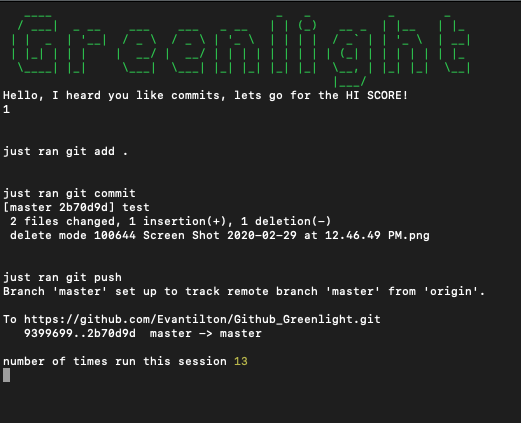

# Github_Greenlight

## Description

_Duration: One Afternoon_

This program makes and commits changes to github on a timer.  It does this by starting a cronjob that executes terminal commands.  These will cause another program to rewrite itself and then commit those changes to github.  This means you could have any number of commits in github that you like or just keep your github eternally greenlit.

This program is meant as a proof of concept and conversation piece.  I do not intend to run this beyond this project.  I just want it to be something interesting that people might notice and dig a little deeper, maybe talk about in interviews. 

## Screen Shot

### Prerequisites

- [Node.js](https://nodejs.org/en/)

## Installation

1. Fork and Clone the repo.
2. Open up your editor of choice and run an `npm install`

## Usage

1. Run the program with `node index.js`
2. The Cronjob will start and depending on what your timer is set for (default 1 minute) it will push a change to github. I wouldn't run it faster than a minute to avoid command conflicts.  (https://www.npmjs.com/package/cron)
3. Keep it running until you have the desired number of commits in your github.

## Built With

1. Javascript
2. Cronjob
3. Chalk
4. Clear
5. Figlet

## Future

I have a number of different ideas for how this could be expanded.  I could use a Command Line Interface to set the Cronjob to a specific interval when you start it up.  I could also use a program like automator.app to make it so this can run on startup.  Lots of potential avenues.

## License
[MIT](https://choosealicense.com/licenses/mit/)

## Acknowledgement
1. This tutorial was really interesting and even though I ended up not using the Github API and a CLI,  it would probably be where I brought the project next. (https://www.sitepoint.com/javascript-command-line-interface-cli-node-js/)
2. User Patrick Roberts for his code in this thread.  It was invaluable in creating something that rewrites itself. (https://codegolf.stackexchange.com/questions/107642/permanently-self-modifying-code)

## Support
If you have suggestions or issues, please email me at [evantilton@gmail.com](www.Etilton.com)